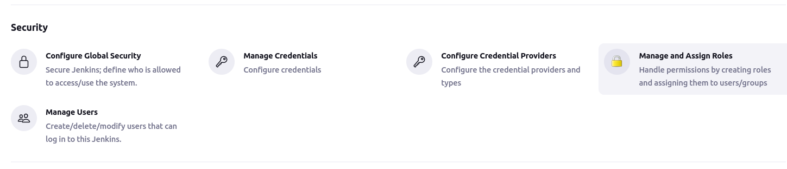
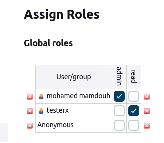
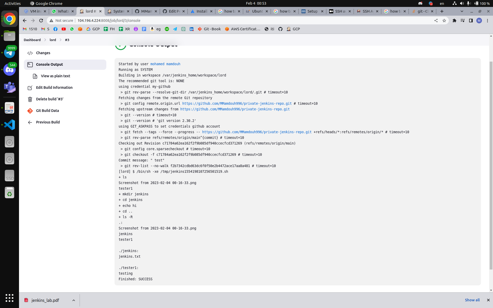
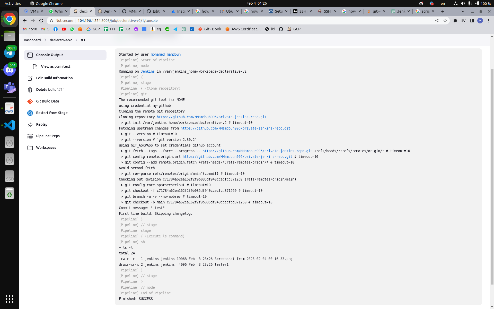
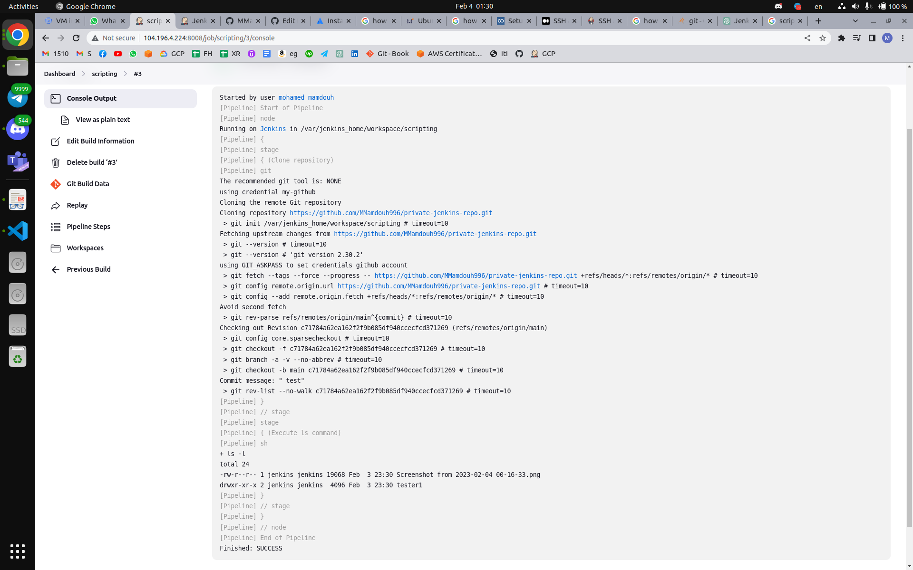
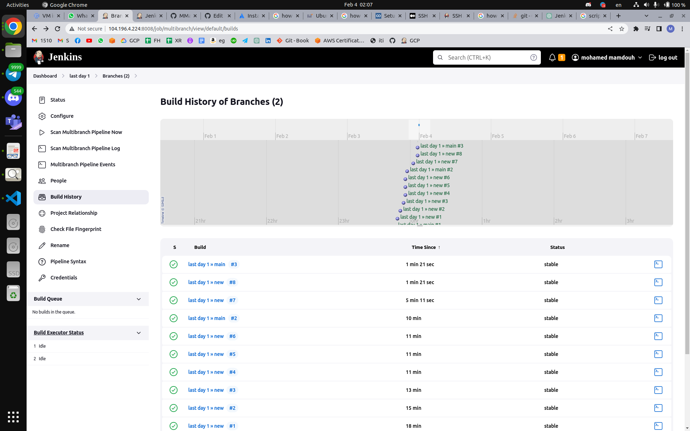
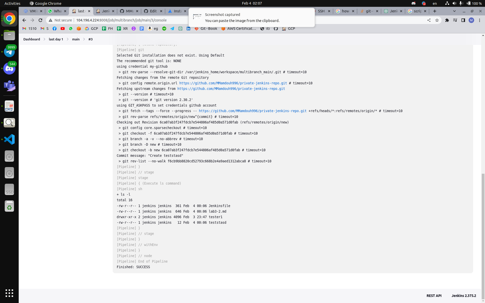
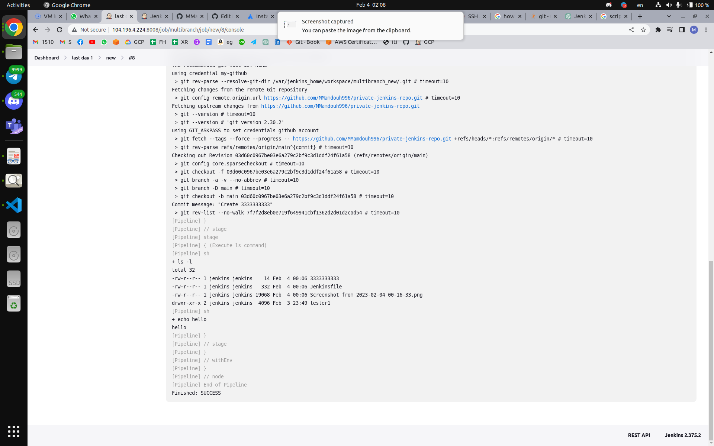

# Jenkins

## Day1

## 1- install jenkins with docker image

```bash
docker run -p 8008:8080 -d --name jenkins jenkins/jenkins:lts
```

## 2- install role based authorization plugin



## 3- create new user

## 4- create read role and assign it to the new user



## 5- create free style pipeline and link it to private git repo(inside it create directory and create file with "hello world")



---

## 1- create declarative in jenkins GUI pipeline for your own repo to do "ls"



## 2- create scripted in jenkins GUI pipeline for your own repo to do "ls"



## 3- create the same with jenkinsfile in your branches as multibranch pipeline





---
4- configure jenkins image to run docker commands on your hos docker daemon
5- create CI/CD for this repo <https://github.com/mahmoud254/jenkins_nodejs_example.git>
#################
1- create docker file to build image for jenkins slave
2- create container from this image and configure ssh
3 from jenkins maste create new node with the slave container
4- integrate slack with jenkins
5- send slack message when stage in your pipeline is successful
6- install audit logs plugin and test it
7- fork the following repo <https://github.com/mahmoud254/Booster_CI_CD_Project> and add
dockerfile to run this django app and use github actions to build the docker image and push it to
your dockerhub
Create infrastructure pipeline to run terraform with jenkins
task
Create ansible script to configure application ec2(private)
8- configure ansible to run over private ips through bastion (~/.ssh/config)
9- write ansible script to configure ec2 to run as jenkins slaves
9- configure slave in jenkins dashboard (with private ip)
10- create pipeline to deploy nodejs_example fro branch (rds_redis)
11- add application load balancer to your terraform code to expose your nodejs app on port 80
on the load balancer
12- test your application by calling loadbalancer_url/db and /redis
13- create documentation illustrating your steps with screenshots
###############################################
