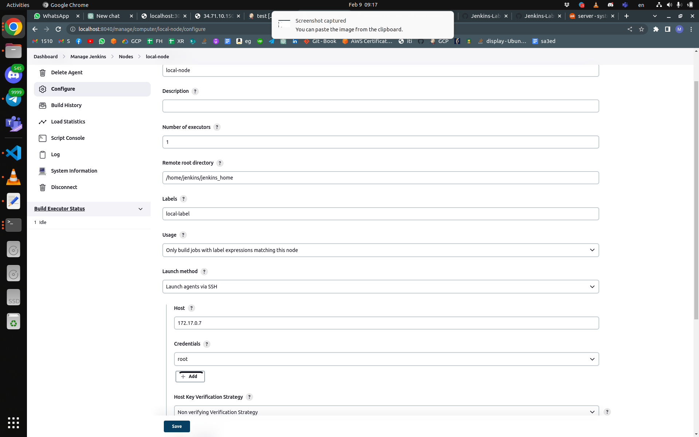
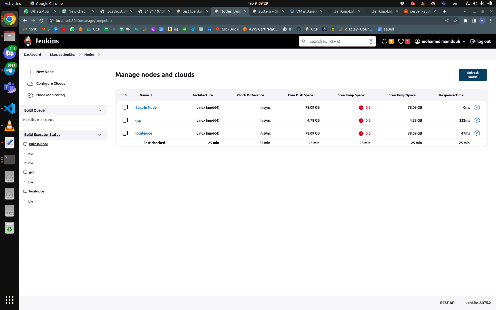
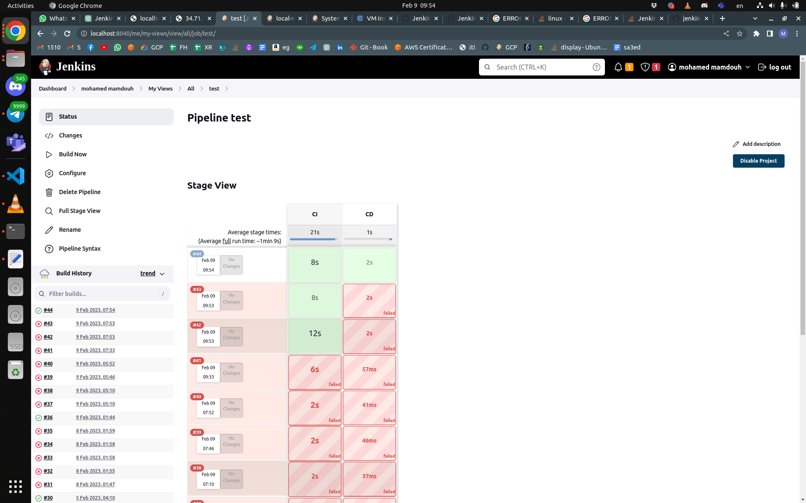
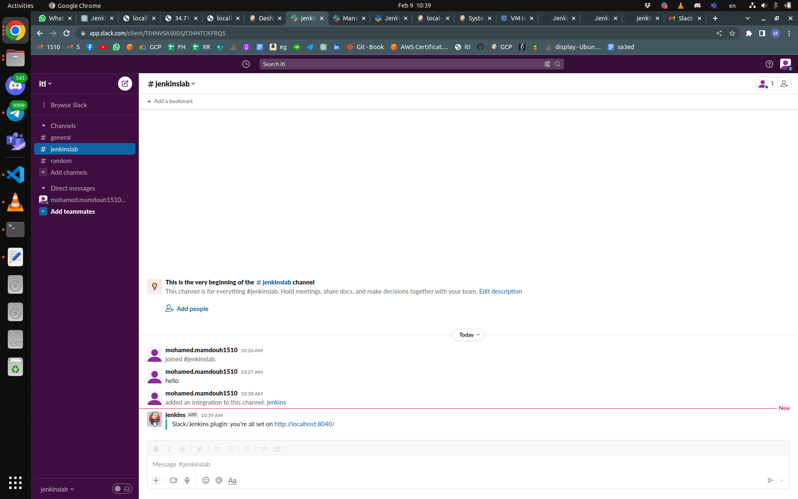
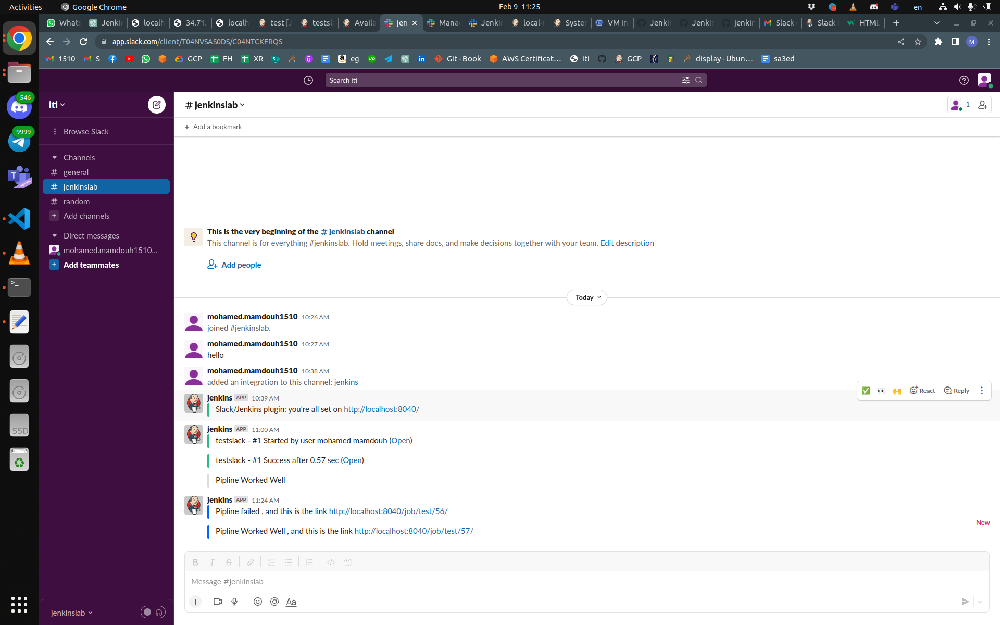
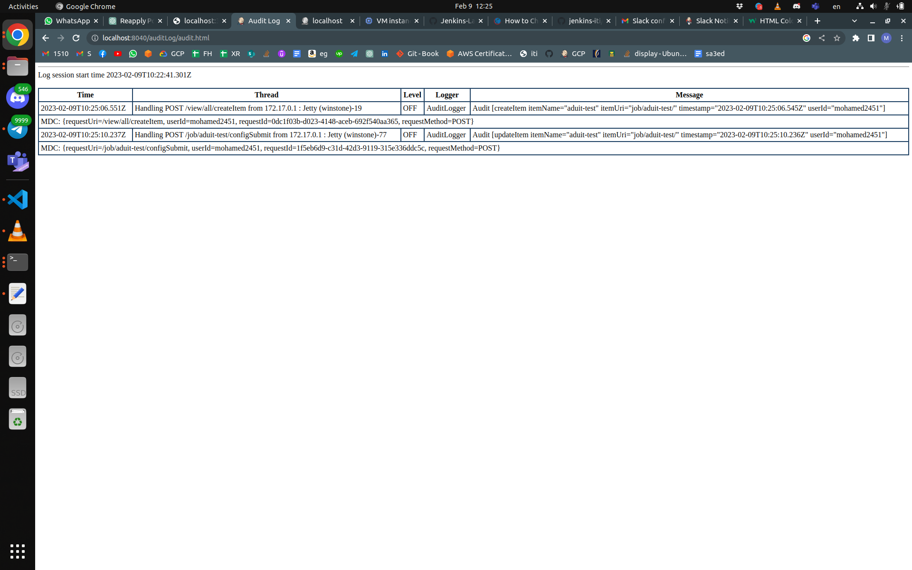

# Jenkins

## Day2

---

## 4- configure jenkins image to run docker commands on your host docker daemon

```docker
# Use the official Jenkins image as the base
FROM jenkins/jenkins:lts

# Set the root user as the default user for the image
USER root

# Install the Docker client
RUN apt-get update && apt-get install -y lsb-release
RUN curl -fsSLo /usr/share/keyrings/docker-archive-keyring.asc \
  https://download.docker.com/linux/debian/gpg
RUN echo "deb [arch=$(dpkg --print-architecture) \
  signed-by=/usr/share/keyrings/docker-archive-keyring.asc] \
  https://download.docker.com/linux/debian \
  $(lsb_release -cs) stable" > /etc/apt/sources.list.d/docker.list
RUN apt-get update && apt-get install -y docker-ce-cli
RUN groupadd docker
RUN usermod -aG docker jenkins


```

## 5- create CI/CD for this repo <https://github.com/mahmoud254/jenkins_nodejs_example.git>


---

## 1- create docker file to build image for jenkins slave

```DOCKER
# Use the latest Ubuntu image
FROM ubuntu:22.04

# Run as root user
USER root

#to install open jdk

RUN apt-get update -qq
RUN apt install -y openjdk-11-jdk

# install ssh server 
RUN apt update
RUN apt-get install -y openssh-server
RUN service ssh start


# adding jenkins user
RUN useradd -ms /bin/bash jenkins

#to install docker
RUN apt-get update -qq
RUN apt-get install \ 
    ca-certificates \
    curl \
    gnupg \
    lsb-release -qq
RUN mkdir -m 0755 -p /etc/apt/keyrings
RUN curl -fsSL https://download.docker.com/linux/ubuntu/gpg | gpg --dearmor -o /etc/apt/keyrings/docker.gpg -qq
RUN echo \
  "deb [arch=$(dpkg --print-architecture) signed-by=/etc/apt/keyrings/docker.gpg] https://download.docker.com/linux/ubuntu \
  $(lsb_release -cs) stable" | tee /etc/apt/sources.list.d/docker.list > /dev/null
RUN apt-get update -qq
RUN apt-get install -y docker-ce 
RUN usermod -aG docker jenkins 

#install git
RUN apt install git

#extra tools for manual testing

# COPY ./root/* /root/.ssh/
USER jenkins
# Set the working directory
WORKDIR /home/jenkins/jenkins_home
# Run a command to print a message
RUN echo "Ubuntu image running as root user with some packages installed!"

# Run a command to start the bash shell
CMD ["/bin/bash"]


```

## 2- create container from this image and configure ssh

```bash
docker build . -t jenkinsslave:v1.4
```

```bash
docker run -it -d jenkinsslave:v1.4 bash
docker exec -it 3d7 bash
```

```bash
 docker exec -u 0 -it 3d7 bash
root@3d7dc41e40eb:/home/jenkins/jenkins_home# service ssh status
 * sshd is not running
root@3d7dc41e40eb:/home/jenkins/jenkins_home# service ssh start
 * Starting OpenBSD Secure Shell server sshd                                                                                                               [ OK ] 
root@3d7dc41e40eb:/home/jenkins/jenkins_home# ssh-keygen  
Generating public/private rsa key pair.
Enter file in which to save the key (/root/.ssh/id_rsa): 
Created directory '/root/.ssh'.
Enter passphrase (empty for no passphrase): 
Enter same passphrase again: 
Your identification has been saved in /root/.ssh/id_rsa
Your public key has been saved in /root/.ssh/id_rsa.pub
The key fingerprint is:
SHA256:SA6fttpu5mF6FjkdOFNbx/cnu2XdJxyFq8Rd1jQARx0 root@3d7dc41e40eb
The key's randomart image is:
+---[RSA 3072]----+
|           oo+oE+|
|        . . + o.*|
|    . .o o o o * |
|     =+oo   o = o|
|      *=S. . o ++|
|     .+..   . + *|
|      +o       =.|
|     ==.      .  |
|    oB+          |
+----[SHA256]-----+
root@3d7dc41e40eb:/home/jenkins/jenkins_home# cd /root/.ssh/
root@3d7dc41e40eb:~/.ssh# ls
id_rsa  id_rsa.pub

```

## 3 from jenkins master create new node with the slave container







---

## 4- integrate slack with jenkins



## 5- send slack message when stage in your pipeline is successful



## 6- install audit logs plugin and test it



## 7- fork the following repo <https://github.com/mahmoud254/Booster_CI_CD_Project> and add dockerfile to run this django app and use github actions to build the docker image and push it to your dockerhub

---

## Create infrastructure pipeline to run terraform with jenkins task

---

Create ansible script to configure application ec2(private)
8- configure ansible to run over private ips through bastion (~/.ssh/config)
9- write ansible script to configure ec2 to run as jenkins slaves
9- configure slave in jenkins dashboard (with private ip)
10- create pipeline to deploy nodejs_example fro branch (rds_redis)
11- add application load balancer to your terraform code to expose your nodejs app on port 80
on the load balancer
12- test your application by calling loadbalancer_url/db and /redis
13- create documentation illustrating your steps with screenshots
###############################################

<!-- sudo apt-get -y install default-jdk
java -version -->
