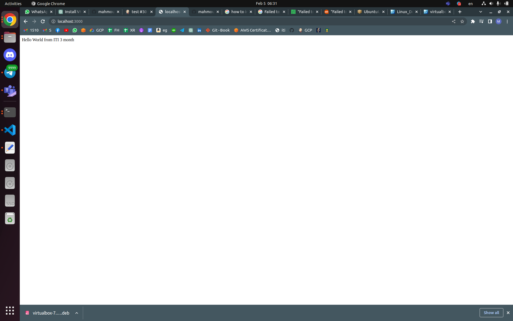

# Jenkins

## Day2

---

## 4- configure jenkins image to run docker commands on your host docker daemon

```docker
# Use the official Jenkins image as the base
FROM jenkins/jenkins:lts

# Set the root user as the default user for the image
USER root

# Install the Docker client
RUN apt-get update && apt-get install -y lsb-release
RUN curl -fsSLo /usr/share/keyrings/docker-archive-keyring.asc \
  https://download.docker.com/linux/debian/gpg
RUN echo "deb [arch=$(dpkg --print-architecture) \
  signed-by=/usr/share/keyrings/docker-archive-keyring.asc] \
  https://download.docker.com/linux/debian \
  $(lsb_release -cs) stable" > /etc/apt/sources.list.d/docker.list
RUN apt-get update && apt-get install -y docker-ce-cli
RUN groupadd docker
RUN usermod -aG docker jenkins


```

## 5- create CI/CD for this repo <https://github.com/mahmoud254/jenkins_nodejs_example.git>



---
#################
1- create docker file to build image for jenkins slave
2- create container from this image and configure ssh
3 from jenkins maste create new node with the slave container
4- integrate slack with jenkins
5- send slack message when stage in your pipeline is successful
6- install audit logs plugin and test it
7- fork the following repo <https://github.com/mahmoud254/Booster_CI_CD_Project> and add
dockerfile to run this django app and use github actions to build the docker image and push it to
your dockerhub
Create infrastructure pipeline to run terraform with jenkins
task
Create ansible script to configure application ec2(private)
8- configure ansible to run over private ips through bastion (~/.ssh/config)
9- write ansible script to configure ec2 to run as jenkins slaves
9- configure slave in jenkins dashboard (with private ip)
10- create pipeline to deploy nodejs_example fro branch (rds_redis)
11- add application load balancer to your terraform code to expose your nodejs app on port 80
on the load balancer
12- test your application by calling loadbalancer_url/db and /redis
13- create documentation illustrating your steps with screenshots
###############################################


sudo apt-get -y install default-jdk
java -version